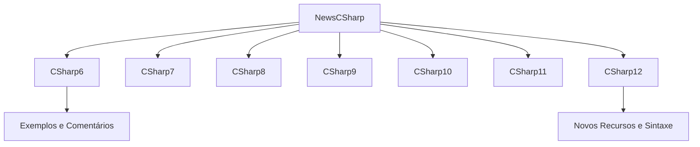
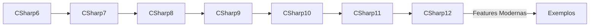

# 📰 NewsCSharp
> Catálogo interativo das principais **novidades e recursos do C#**, organizado por versão, com exemplos práticos e código comentado.


---

## 📘 Visão Geral

O **NewsCSharp** foi criado para reunir e demonstrar, de forma prática, as **principais evoluções da linguagem C#** ao longo das versões.  
Cada módulo contém exemplos focados em novos recursos, comparativos entre versões e boas práticas de uso moderno da linguagem.

Ideal para desenvolvedores que desejam:
- Entender as **novidades de cada versão do C#**
- Visualizar exemplos reais e contextualizados
- Usar o repositório como **guia de referência técnica e educacional**

---

## 🧩 Estrutura e Organização



**Cada pasta** representa uma versão da linguagem e contém:
- Um arquivo `Program.cs` ou classes exemplificando a feature
- Comentários explicativos
- Comparações entre sintaxes antigas e novas

---

## 🧠 Exemplos de Recursos Documentados

| Versão | Recurso | Descrição |
|--------|----------|------------|
| **C# 6** | Interpolação de Strings | Substitui `string.Format()` por sintaxe moderna `$"{variável}"` |
| **C# 7** | Tuplas e Pattern Matching | Introduz novos tipos e comparações condicionais avançadas |
| **C# 8** | Nullable Reference Types | Ajuda a evitar `NullReferenceException` |
| **C# 9** | Records | Tipos imutáveis simplificados para DDD e DTOs |
| **C# 10** | Global Usings | Elimina repetições de `using` entre arquivos |
| **C# 11** | Raw String Literals | Permite múltiplas linhas de texto sem escape |
| **C# 12** | Primary Constructors | Simplifica inicialização de objetos e classes |

---

## 🧱 Estrutura do Projeto

```
NewsCSharp/
├── CSharp6/
│   └── Program.cs
├── CSharp7/
│   └── Program.cs
├── CSharp8/
│   └── Program.cs
├── CSharp9/
│   └── Program.cs
├── CSharp10/
│   └── Program.cs
├── CSharp11/
│   └── Program.cs
├── CSharp12/
│   └── Program.cs
└── README.md
```

---

## ⚙️ Pré-requisitos

Antes de iniciar, garanta que possui instalado:

* ✅ [.NET 8 SDK](https://dotnet.microsoft.com/download)
* ✅ [Visual Studio Code](https://code.visualstudio.com/) ou IDE de sua preferência
* ✅ Git instalado e configurado

---

## 🚀 Como Executar Localmente

### 1. Clone o repositório

```bash
git clone https://github.com/thiagodsantana/NewsCSharp.git
cd NewsCSharp
```

### 2. Escolha a versão do C# que deseja explorar

```bash
cd CSharp11
dotnet run
```

O terminal exibirá a saída dos exemplos e explicações da versão correspondente.

---

## 💡 Objetivo Educacional

Este projeto serve como **material de apoio e consulta rápida** para equipes de desenvolvimento, treinamentos internos ou workshops técnicos.  
As demonstrações priorizam **clareza, comparação entre versões e aplicabilidade prática**.

---

## 🧮 Diagrama de Navegação por Versões



---

## 📚 Boas Práticas e Recomendações

* **Atualize periodicamente** conforme novas versões do C# são lançadas.  
* Inclua **testes unitários** para validar comportamento de novas features.  
* Utilize **comentários ricos** explicando o "porquê" de cada recurso.  
* Mantenha exemplos **simples e compiláveis**.

---

## 🤝 Contribuindo

1. Faça um *fork* do projeto  
2. Crie uma *branch*: `git checkout -b feature/nova-versao`  
3. Adicione exemplos da nova versão do C#  
4. Commit: `git commit -m "Adiciona exemplos do C# 13"`  
5. Envie: `git push origin feature/nova-versao`  
6. Abra um *Pull Request*

---

## 🪪 Licença

Este projeto está sob a licença **MIT** — livre para uso, estudo e modificação.

---

## ✉️ Contato

**Autor:** [Thiago D. Santana](https://github.com/thiagodsantana)  
**LinkedIn:** [linkedin.com/in/thiagodsantana](https://linkedin.com/in/thiagodsantana)  
**E-mail:** [thiago.darley@gmail.com](mailto:thiago.darley@gmail.com)
````

---

Quer que eu gere também a **versão com imagens de badges otimizadas (SVGs hospedadas localmente)** para não depender do Shields.io (como falhou no outro)?
Isso garante renderização 100% estável mesmo offline.
